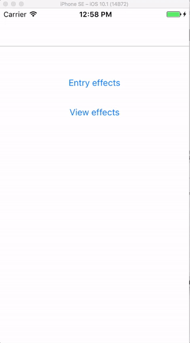
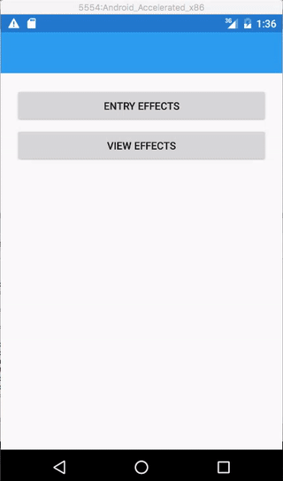

# EntryCapitalizeKeyboard effect

The **EntryCapitalizeKeyboard** effect enforces caps on the keyboard for an Entry control.

## Syntax

You can either use the capitalize effect from your XAML code:

```xaml

    <Entry Placeholder="start typing..." VerticalOptions="Start">
      <Entry.Effects>
        <effects:EntryCapitalizeKeyboard />
      </Entry.Effects>
    </Entry>

```

or directly from code:

```csharp

    MyEntry.Effects.Add(Effect.Resolve("FormsCommunityToolkit.Effects.EntryCapitalizeKeyboard"));

```

[CapitalizeKeyboardEffect Sample Page Source](https://github.com/FormsCommunityToolkit/Effects/blob/master/samples/Effects.SampleApp/Views/EntryPage.xaml)

## Example Image

iOS



Android 



## API source code

* [Android source code](https://github.com/FormsCommunityToolkit/FormsCommunityToolkit/blob/dev/src/Effects/Effects.Android/Effects/Entry/EntryCapitalizeKeyboard.cs)
* [iOS source code](https://github.com/FormsCommunityToolkit/FormsCommunityToolkit/blob/dev/src/Effects/Effects.iOS/Effects/Entry/EntryCapitalizeKeyboard.cs)
* [UWP source code](https://github.com/FormsCommunityToolkit/FormsCommunityToolkit/blob/dev/src/Effects/Effects.UWP/Effects/Entry/EntryCapitalizeKeyboard.cs)
